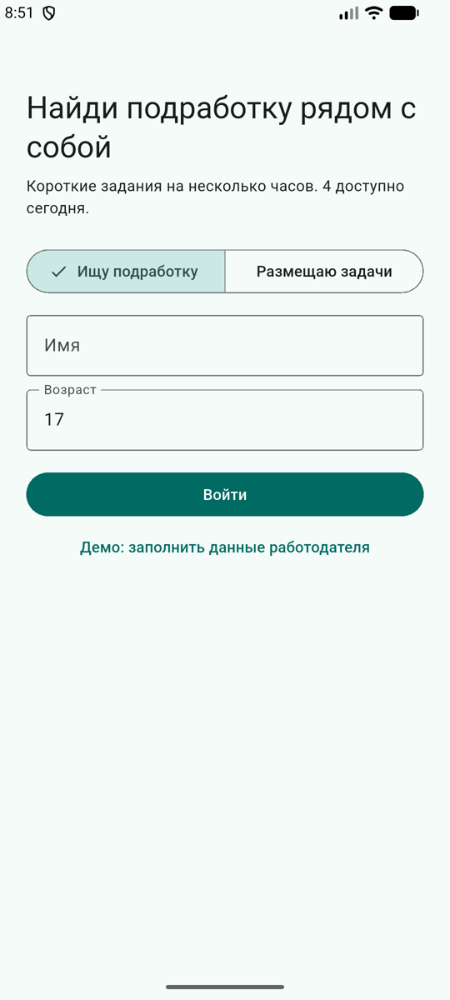
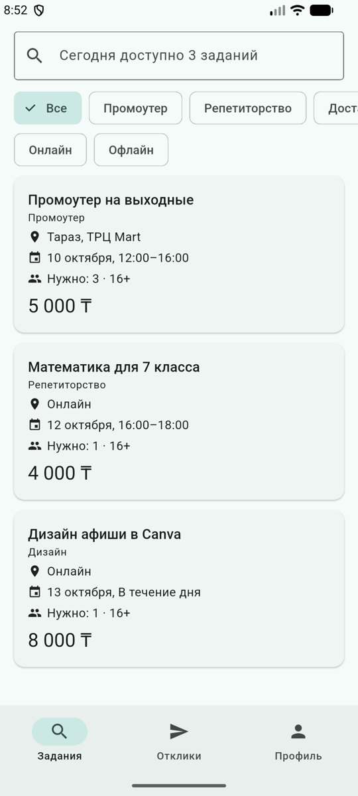
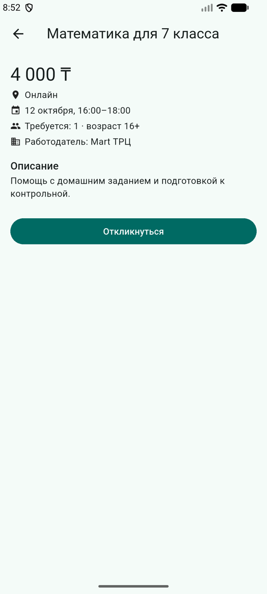
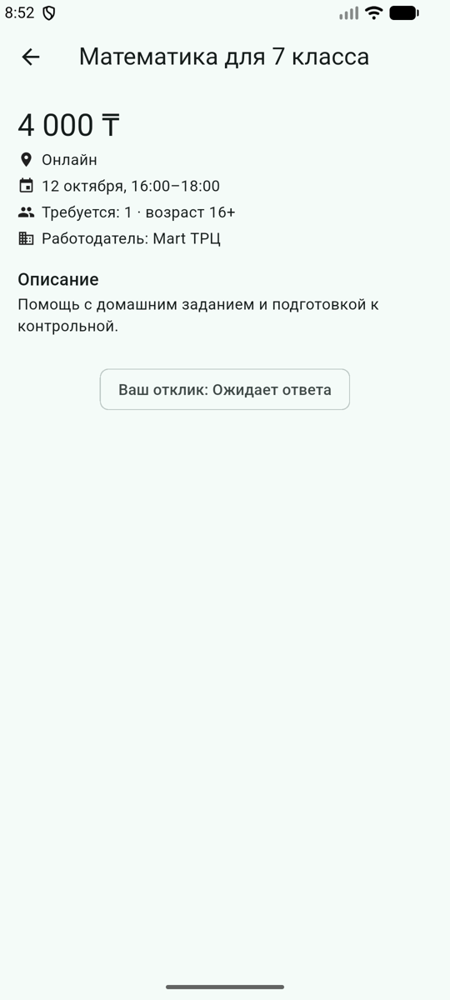
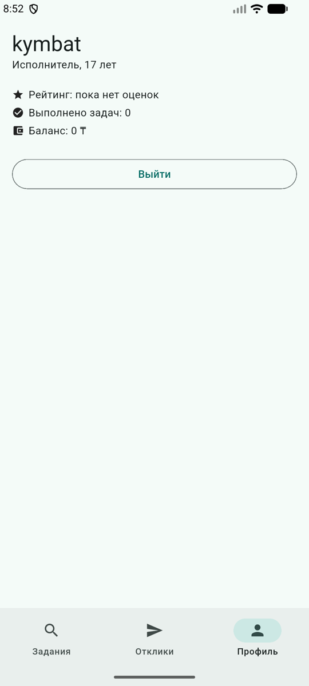
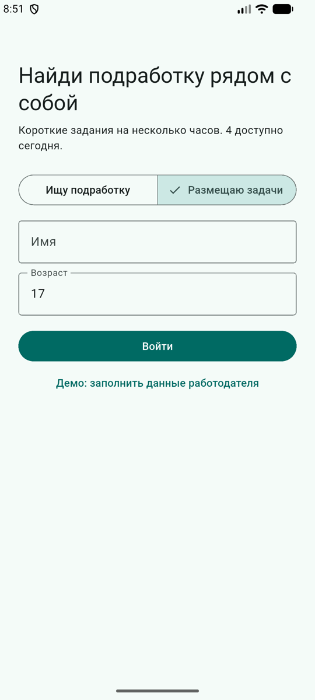
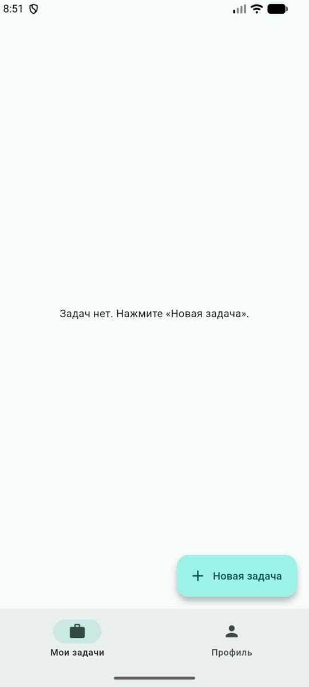
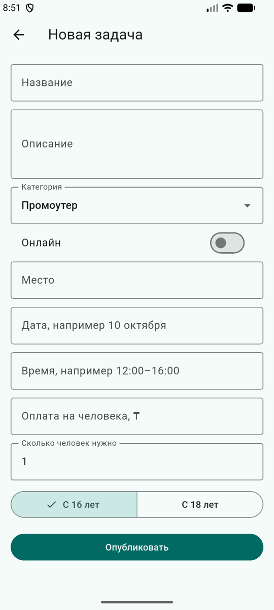
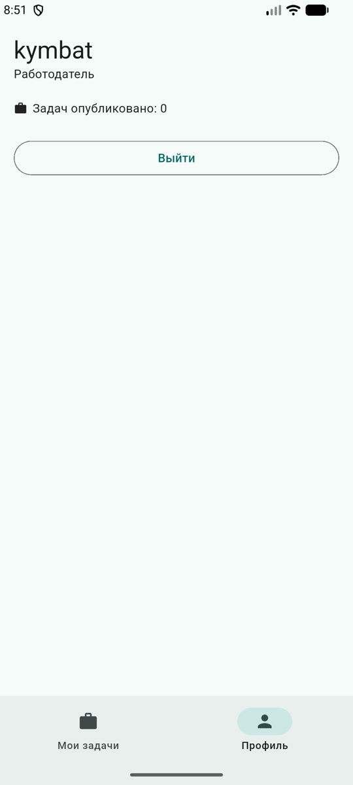

# QuickJob

Мобильное приложение на Flutter: маркетплейс микроподработок для школьников и студентов. Работодатель публикует задание на несколько часов или один день, исполнитель откликается, работодатель выбирает исполнителя, подтверждает выполнение и оплачивает работу через платформу.

> Статус: рабочий MVP-прототип. Данные хранятся в памяти устройства, серверной части пока нет.

## Идея

Обычные сайты вакансий ищут сотрудников на постоянную работу. QuickJob решает другую задачу: «Я свободен в субботу с 12:00 до 18:00 и хочу заработать 5 000 ₸» и «Мне нужно 3 человека на мероприятие на 5 часов».

Основной сценарий:

```
Задание → отклик → выбор исполнителя → выполнение → подтверждение → оплата → отзыв
```

## Возможности

**Исполнитель**
- регистрация с указанием возраста;
- каталог заданий с поиском, фильтром по категориям и по формату (онлайн/офлайн);
- страница задания и отклик с сообщением;
- вкладка «Отклики» со статусами (ожидает, принят, отклонён);
- профиль: рейтинг, число выполненных задач, баланс.

**Работодатель**
- создание задания: категория, место, дата, время, оплата, число людей, возрастное ограничение;
- список откликов с профилями исполнителей, кнопки «Принять» и «Отклонить»;
- подтверждение выполнения и оценка исполнителей.

**Платформа**
- ограничение по возрасту: сервис доступен с 16 лет;
- статусы задания: `Активно` → `Исполнитель выбран` → `Оплачено`.

## Скриншоты

### Исполнитель

<table>
  <tr>
    <td align="center"><br>Вход</td>
    <td align="center"><br>Каталог с фильтрами</td>
    <td align="center"><br>Страница задания</td>
    <td align="center"><br>Отклик с сообщением</td>
  </tr>
  <tr>
    <td align="center"><br>Отклик отправлен</td>
    <td align="center"><br>Мои отклики</td>
    <td align="center"><br>Профиль</td>
    <td></td>
  </tr>
</table>

### Работодатель

<table>
  <tr>
    <td align="center"><br>Вход</td>
    <td align="center"><br>Мои задачи</td>
    <td align="center"><br>Новая задача</td>
    <td align="center"><br>Профиль</td>
  </tr>
</table>

## Запуск

Требования: [Flutter](https://docs.flutter.dev/get-started/install) 3.16 или новее (Dart 3).

```bash
git clone https://github.com/<ваш-аккаунт>/quickjob.git
cd quickjob
flutter pub get
flutter run
```

Если в репозитории только папка `lib/`, создайте проект и скопируйте в него код:

```bash
flutter create quickjob
# замените quickjob/lib/main.dart файлом из этого репозитория
cd quickjob
flutter run
```

Сторонние пакеты не используются.

## Как проверить весь цикл

1. Войдите как **исполнитель** (имя любое, возраст 16 или больше) и откликнитесь на задание «Промоутер на выходные».
2. Нажмите «Выйти» в профиле.
3. На экране входа выберите «Размещаю задачи», нажмите «Демо: заполнить данные работодателя» и войдите.
4. Откройте задачу, примите отклик и нажмите «Подтвердить выполнение и оплатить», поставьте оценку.
5. Снова войдите как исполнитель и проверьте баланс и рейтинг в профиле.

## Структура проекта

Весь код находится в `lib/main.dart` и разделён на блоки:

| Блок | Что содержит |
|---|---|
| Модели | `AppUser`, `Task`, `Reply` и статусы |
| `Store` | хранилище в памяти (`ChangeNotifier`): вход, задачи, отклики, оплата |
| Вход | `LoginPage` |
| Главный экран | `HomePage`, нижняя навигация |
| Исполнитель | `CatalogTab`, `TaskPage`, `MyRepliesTab` |
| Работодатель | `MyTasksTab`, `EmployerTaskPage`, `CreateTaskPage` |
| Профиль | `ProfileTab` |

## Ограничения

- Данные хранятся в памяти и пропадают при перезапуске приложения.
- Пользователи разных устройств друг друга не видят.
- Оплата и комиссия имитируются, реальных платежей нет.
- Возраст указывается самим пользователем и не проверяется.
- Правила для несовершеннолетних упрощены. Перед реальным запуском их нужно сверить с трудовым законодательством Республики Казахстан.

## Планы развития

- [ ] серверная часть (Firebase или Supabase) и авторизация по номеру телефона
- [ ] хранение данных и синхронизация между устройствами
- [ ] чат между работодателем и исполнителем
- [ ] карта заданий рядом с пользователем
- [ ] push-уведомления
- [ ] избранное, история заданий, статистика заработка
- [ ] онлайн-оплата с удержанием средств до подтверждения работы
- [ ] верификация личности и согласие родителей для несовершеннолетних
- [ ] жалобы и разрешение споров
